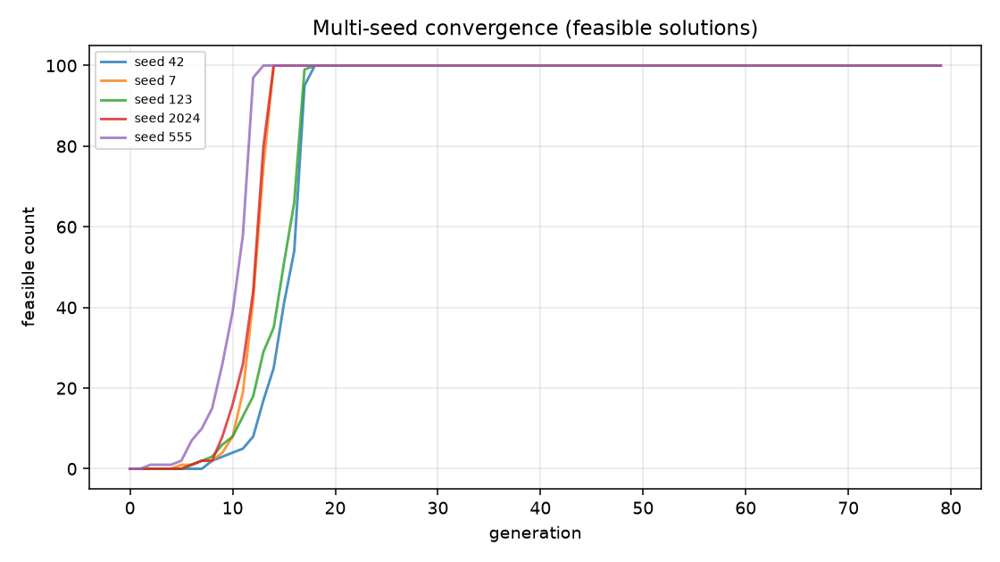
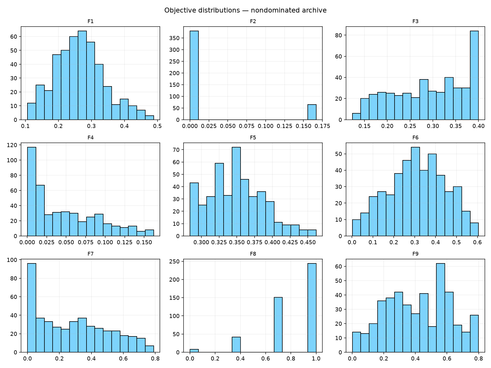
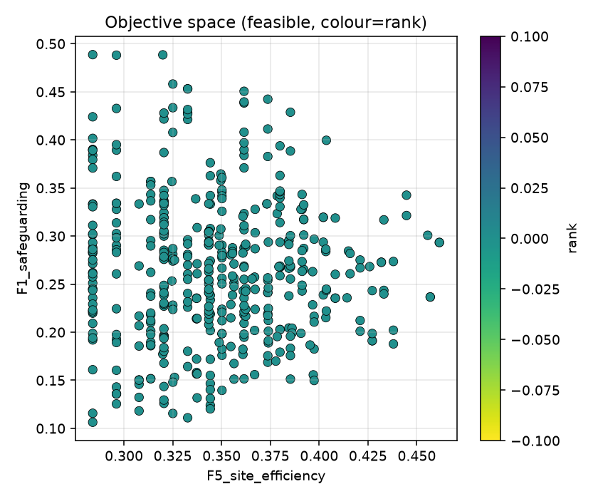
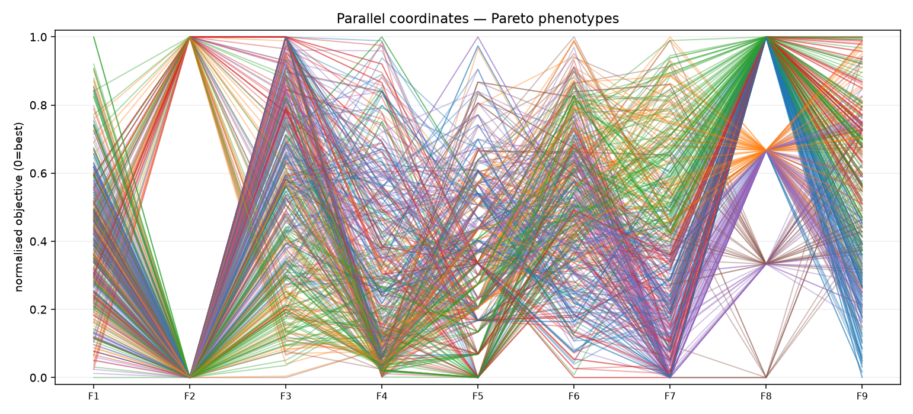
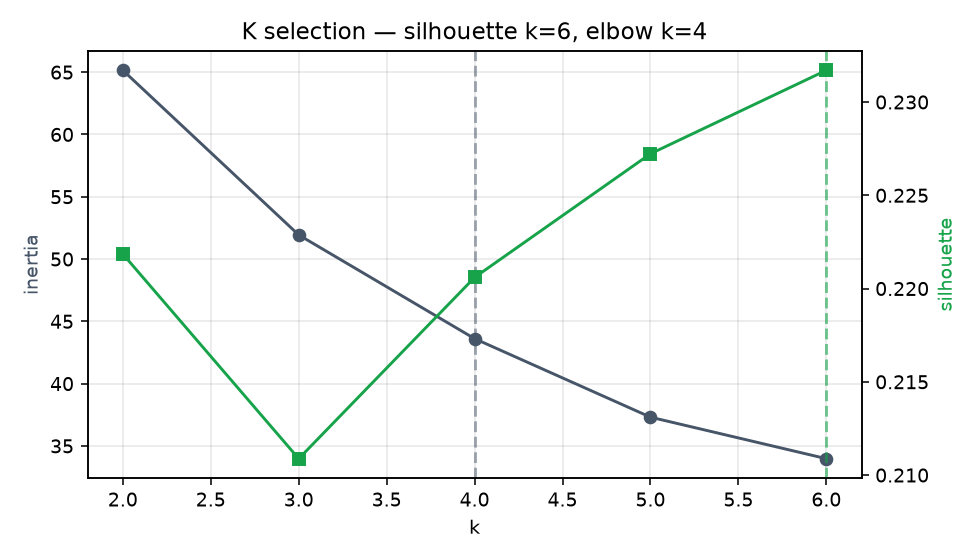
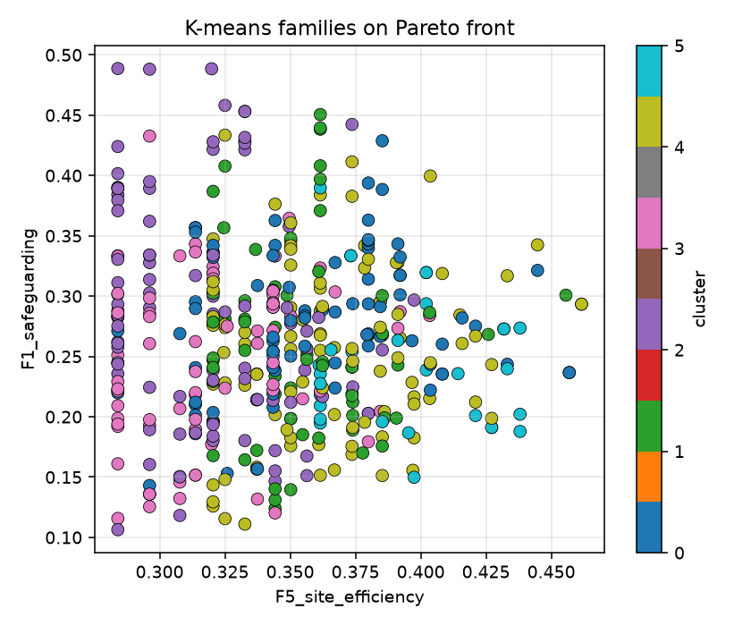
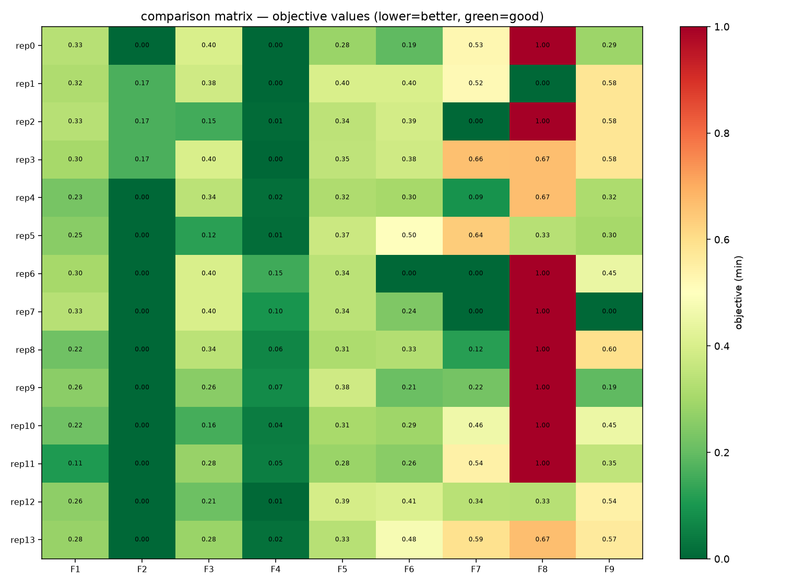

# arsitrad-evo — RESEARCH REPORT
## Evolutionary spatial programming for The Threshold Community (5,533.85 m²)

**Algorithm:** constrained NSGA-II (Deb, Pratap, Agarwal & Meyarivan, 2002) `[PAPER METHOD]`  
**Framework:** modularity-based spatial programming (Riskiyanto, Wibisono & Harani, 2025) — *architectural-scale adaptation* `[PAPER METHOD]`  
**Post-processing:** K-means (silhouette + elbow) — never feeds selection `[DESIGN HYPOTHESIS]`  
**Runtime deps:** Python + numpy/scipy/scikit-learn/matplotlib/pandas only. No Rhino/Grasshopper/Wallacei/jMetal/Helix.

> **Evidence discipline.** `[PAPER METHOD]` validated algorithm/framework · `[PA5 CORPUS]` project program & rules · `[DESIGN HYPOTHESIS]` unvalidated proxy · `[TO VERIFY]` needs authority/operator input. Riskiyanto et al. validated on office furniture; this is an **unvalidated architectural adaptation**. Optimization never overrides safeguarding/accessibility/dignity (hard constraints).

---

## 1. Traceable chain
`MODULE LIBRARY → GENOTYPE → DECODING → HARD CONSTRAINTS → OBJECTIVES → NSGA-II EVOLUTION → PARETO FRONT → K-MEANS CLUSTERS → REPRESENTATIVE PHENOTYPES → ARCHITECTURAL INTERPRETATION`

## 2. Module library → Genotype → Decoding
- **Module library** (`arsitrad_evo/modules.py`): 12 Threshold module types (A0 Civic, B0 Care, C0 Commons, R4 Domestic cluster [repeatable], E0 Staff, F0 Service, M0 Technical, H0 Learning, I0 Reflection, J0 Livelihood, K0 Community, L0 Transition) with net area, privacy level, developmental/variational flag, stacking cap, and the adjacency matrix (MUST/NEAR/SCREENED/AVOID/PROHIBITED).
- **Genotype** (`genotype.py`): mixed real/integer vector. Structural genes — `n_R4` (2–4), `has_H0/J0/K0/I0/L0` (0/1), `floors_C0/H0` (1–2), `landscape_frac`, `service_depth`, `buffer_depth`, `reserve_area` — plus a variable-length (x,y) placement tail. `public_intensity` is **derived** from present public modules for genotype coherence.
- **Decoding**: genotype → placed axis-aligned rectangles (centroid, w×d, floors), derived footprint/GFA/occupancy/landscape, adjacency graph, privacy tags. Phase-1 = program+zoning only.

## 3. Hard constraints (constrained domination)
Violation ≥ 0; feasible iff all hard violations = 0. Feasible always dominates infeasible; among infeasible, smaller total violation wins.
`overlap · site/buildable limit · required developmental modules · permitted populations · prohibited adjacency (R4↔F0/M0/K0) · privacy hierarchy · safeguarding access · care access to R4 · no public→private shortcut · independent service access · stacking rules · landscape band · accessibility/egress (placeholder [TO VERIFY])`. See `constraints.py`.

## 4. Objectives F1–F9 (all minimised)
F1 safeguarding · F2 privacy/agency · F3 everyday life · F4 service separation · F5 site efficiency · F6 adaptability · F7 domestic scale (residential dispersion) · F8 controlled community connection · F9 landscape/buffer. Equations/normalization/assumptions in `objectives.py` + `SPEC.md`.

## 5. NSGA-II evolution — multi-seed runs
Base config: pop=100 gen=80. Seeds: [42, 7, 123, 2024, 555].

| seed | runtime_s | pop | gen | feasible_final | feasible_rate | pareto_size |
|---|---|---|---|---|---|---|
| 42.0 | 12.5 | 100.0 | 80.0 | 100.0 | 1.0 | 100.0 |
| 7.0 | 13.11 | 100.0 | 80.0 | 100.0 | 1.0 | 100.0 |
| 123.0 | 12.31 | 100.0 | 80.0 | 100.0 | 1.0 | 100.0 |
| 2024.0 | 13.51 | 100.0 | 80.0 | 100.0 | 1.0 | 100.0 |
| 555.0 | 12.86 | 100.0 | 80.0 | 100.0 | 1.0 | 100.0 |



## 6. Sensitivity tests
Parameters swept: population size, generation count, crossover probability, mutation probability, mutation strength (η). Recorded: runtime, feasible rate, Pareto-front size, objective stats.

| param | value | runtime_s | feasible_rate | pareto_size | obj_F5_mean |
|---|---|---|---|---|---|
| pop_size | 60 | 5.69 | 1.0 | 60 | 0.343 |
| pop_size | 100 | 12.49 | 1.0 | 100 | 0.343 |
| pop_size | 160 | 27.31 | 1.0 | 160 | 0.335 |
| generations | 40 | 5.32 | 1.0 | 100 | 0.333 |
| generations | 80 | 12.72 | 1.0 | 100 | 0.343 |
| generations | 120 | 19.76 | 1.0 | 100 | 0.351 |
| crossover_prob | 0.6 | 14.56 | 1.0 | 100 | 0.335 |
| crossover_prob | 0.8 | 13.19 | 1.0 | 100 | 0.347 |
| crossover_prob | 0.9 | 12.49 | 1.0 | 100 | 0.343 |
| crossover_prob | 1.0 | 12.64 | 1.0 | 100 | 0.354 |
| mutation_prob | default | 12.49 | 1.0 | 100 | 0.343 |
| mutation_prob | 0.03 | 12.98 | 1.0 | 100 | 0.329 |
| mutation_prob | 0.08 | 11.49 | 1.0 | 100 | 0.335 |
| mutation_prob | 0.15 | 11.29 | 1.0 | 100 | 0.339 |
| mutation_strength_eta | 5 | 12.87 | 1.0 | 100 | 0.345 |
| mutation_strength_eta | 15 | 12.5 | 1.0 | 100 | 0.343 |
| mutation_strength_eta | 20 | 12.5 | 1.0 | 100 | 0.343 |
| mutation_strength_eta | 30 | 12.82 | 1.0 | 100 | 0.342 |


## 7. Nondominated archive (Pareto front)
Combined nondominated archive across seeds: **445** solutions (re-sorted on the union of per-seed rank-1 sets).

Objective ranges across the archive:

| objective | min | max |
|---|---|---|
| obj_F1_safeguarding | 0.106 | 0.489 |
| obj_F2_privacy_agency | 0.0 | 0.167 |
| obj_F3_everyday_life | 0.123 | 0.4 |
| obj_F4_service_separation | 0.0 | 0.162 |
| obj_F5_site_efficiency | 0.284 | 0.462 |
| obj_F6_adaptability | 0.002 | 0.605 |
| obj_F7_domestic_scale | 0.0 | 0.79 |
| obj_F8_community_connection | 0.0 | 1.0 |
| obj_F9_landscape_buffer | 0.0 | 0.8 |







## 8. K-means clustering of the Pareto front
Chosen **k = 6** (silhouette) · elbow k = 4 · silhouette = 0.232.





## 9. Representative phenotypes (medoids + objective extremes)
**14** representatives exported, each with a machine-readable traceability record (`data/phenotype_XX.json`).

### 9.1 Comparison matrix
| rep | n_R4 | residents | day_users | gfa | footprint | landscape_frac | F1_safeguarding | F2_privacy_agency | F3_everyday_life | F4_service_separation | F5_site_efficiency | F6_adaptability | F7_domestic_scale | F8_community_connection | F9_landscape_buffer |
|---|---|---|---|---|---|---|---|---|---|---|---|---|---|---|---|
| 0.0 | 2.0 | 8.0 | 8.0 | 991.0 | 840.6 | 0.514 | 0.333 | 0.0 | 0.4 | 0.001 | 0.284 | 0.192 | 0.527 | 1.0 | 0.287 |
| 1.0 | 2.0 | 8.0 | 32.0 | 1449.0 | 1190.2 | 0.391 | 0.32 | 0.167 | 0.381 | 0.001 | 0.402 | 0.402 | 0.516 | 0.0 | 0.581 |
| 2.0 | 2.0 | 8.0 | 16.0 | 1127.0 | 1018.9 | 0.391 | 0.333 | 0.167 | 0.154 | 0.011 | 0.344 | 0.389 | 0.0 | 1.0 | 0.581 |
| 3.0 | 2.0 | 8.0 | 16.0 | 1033.0 | 1032.4 | 0.391 | 0.301 | 0.167 | 0.4 | 0.0 | 0.349 | 0.379 | 0.664 | 0.667 | 0.581 |
| 4.0 | 2.0 | 8.0 | 16.0 | 1099.0 | 948.6 | 0.502 | 0.227 | 0.0 | 0.341 | 0.017 | 0.32 | 0.301 | 0.092 | 0.667 | 0.316 |
| 5.0 | 2.0 | 8.0 | 24.0 | 1107.0 | 1106.1 | 0.507 | 0.254 | 0.0 | 0.123 | 0.014 | 0.374 | 0.502 | 0.64 | 0.333 | 0.302 |
| 6.0 | 4.0 | 16.0 | 8.0 | 1017.0 | 1016.6 | 0.363 | 0.304 | 0.0 | 0.4 | 0.149 | 0.343 | 0.002 | 0.0 | 1.0 | 0.448 |
| 7.0 | 4.0 | 16.0 | 8.0 | 1017.0 | 1016.6 | 0.55 | 0.334 | 0.0 | 0.4 | 0.097 | 0.343 | 0.242 | 0.0 | 1.0 | 0.001 |
| 8.0 | 3.0 | 12.0 | 8.0 | 929.0 | 928.6 | 0.343 | 0.218 | 0.0 | 0.343 | 0.063 | 0.314 | 0.328 | 0.121 | 1.0 | 0.596 |
| 9.0 | 4.0 | 16.0 | 16.0 | 1125.0 | 1124.6 | 0.47 | 0.259 | 0.0 | 0.256 | 0.075 | 0.38 | 0.209 | 0.224 | 1.0 | 0.192 |
| 10.0 | 2.0 | 8.0 | 8.0 | 1061.0 | 910.9 | 0.445 | 0.217 | 0.0 | 0.16 | 0.044 | 0.308 | 0.29 | 0.459 | 1.0 | 0.452 |
| 11.0 | 2.0 | 8.0 | 8.0 | 991.0 | 840.6 | 0.487 | 0.106 | 0.0 | 0.279 | 0.049 | 0.284 | 0.256 | 0.544 | 1.0 | 0.352 |
| 12.0 | 3.0 | 12.0 | 24.0 | 1417.0 | 1158.1 | 0.366 | 0.263 | 0.0 | 0.211 | 0.006 | 0.391 | 0.409 | 0.336 | 0.333 | 0.543 |
| 13.0 | 2.0 | 8.0 | 16.0 | 1093.0 | 984.6 | 0.398 | 0.279 | 0.0 | 0.282 | 0.021 | 0.333 | 0.478 | 0.592 | 0.667 | 0.566 |



### 9.2 Per-phenotype summaries
#### phenotype_00 — medoid (cluster 2)
- **Capacity:** 8 residents (2 clusters) · 8 day users
- **Areas:** GFA 991 m² · footprint 840.6 m² · landscape 2844.0 m² (51%) · reserve 267.5 m²
- **Genes:** n_R4=2, H0=0, J0=0, K0=0, I0=0, L0=0, public_intensity=0, floors_C0=2, floors_H0=2
- **Strongest objective:** F2_privacy_agency · **weakest:** F8_community_connection
- figures: `phenotype_00_siteplan.png`, `_privacy.png`, `_stacking.png`, `_circulation.png`, `_landscape.png`, `_radar.png`

#### phenotype_01 — medoid (cluster 5)
- **Capacity:** 8 residents (2 clusters) · 32 day users
- **Areas:** GFA 1449 m² · footprint 1190.2 m² · landscape 2165.2 m² (39%) · reserve 200.1 m²
- **Genes:** n_R4=2, H0=1, J0=1, K0=1, I0=0, L0=0, public_intensity=3, floors_C0=2, floors_H0=2
- **Strongest objective:** F8_community_connection · **weakest:** F9_landscape_buffer
- figures: `phenotype_01_siteplan.png`, `_privacy.png`, `_stacking.png`, `_circulation.png`, `_landscape.png`, `_radar.png`

#### phenotype_02 — medoid (cluster 3)
- **Capacity:** 8 residents (2 clusters) · 16 day users
- **Areas:** GFA 1127 m² · footprint 1018.9 m² · landscape 2165.2 m² (39%) · reserve 195.1 m²
- **Genes:** n_R4=2, H0=1, J0=0, K0=0, I0=0, L0=1, public_intensity=1, floors_C0=1, floors_H0=2
- **Strongest objective:** F7_domestic_scale · **weakest:** F8_community_connection
- figures: `phenotype_02_siteplan.png`, `_privacy.png`, `_stacking.png`, `_circulation.png`, `_landscape.png`, `_radar.png`

#### phenotype_03 — medoid (cluster 1)
- **Capacity:** 8 residents (2 clusters) · 16 day users
- **Areas:** GFA 1033 m² · footprint 1032.4 m² · landscape 2165.2 m² (39%) · reserve 200.3 m²
- **Genes:** n_R4=2, H0=0, J0=1, K0=0, I0=0, L0=1, public_intensity=1, floors_C0=1, floors_H0=1
- **Strongest objective:** F4_service_separation · **weakest:** F8_community_connection
- figures: `phenotype_03_siteplan.png`, `_privacy.png`, `_stacking.png`, `_circulation.png`, `_landscape.png`, `_radar.png`

#### phenotype_04 — medoid (cluster 4)
- **Capacity:** 8 residents (2 clusters) · 16 day users
- **Areas:** GFA 1099 m² · footprint 948.6 m² · landscape 2775.4 m² (50%) · reserve 227.4 m²
- **Genes:** n_R4=2, H0=1, J0=0, K0=0, I0=0, L0=0, public_intensity=1, floors_C0=2, floors_H0=1
- **Strongest objective:** F2_privacy_agency · **weakest:** F8_community_connection
- figures: `phenotype_04_siteplan.png`, `_privacy.png`, `_stacking.png`, `_circulation.png`, `_landscape.png`, `_radar.png`

#### phenotype_05 — medoid (cluster 5)
- **Capacity:** 8 residents (2 clusters) · 24 day users
- **Areas:** GFA 1107 m² · footprint 1106.1 m² · landscape 2808.3 m² (51%) · reserve 146.0 m²
- **Genes:** n_R4=2, H0=1, J0=1, K0=0, I0=1, L0=0, public_intensity=2, floors_C0=1, floors_H0=1
- **Strongest objective:** F2_privacy_agency · **weakest:** F7_domestic_scale
- figures: `phenotype_05_siteplan.png`, `_privacy.png`, `_stacking.png`, `_circulation.png`, `_landscape.png`, `_radar.png`

#### phenotype_06 — extreme (cluster 3)
- **Capacity:** 16 residents (4 clusters) · 8 day users
- **Areas:** GFA 1017 m² · footprint 1016.6 m² · landscape 2010.3 m² (36%) · reserve 269.1 m²
- **Genes:** n_R4=4, H0=0, J0=0, K0=0, I0=0, L0=0, public_intensity=0, floors_C0=1, floors_H0=1
- **Strongest objective:** F2_privacy_agency · **weakest:** F8_community_connection
- figures: `phenotype_06_siteplan.png`, `_privacy.png`, `_stacking.png`, `_circulation.png`, `_landscape.png`, `_radar.png`

#### phenotype_07 — extreme (cluster 0)
- **Capacity:** 16 residents (4 clusters) · 8 day users
- **Areas:** GFA 1017 m² · footprint 1016.6 m² · landscape 3042.4 m² (55%) · reserve 139.6 m²
- **Genes:** n_R4=4, H0=0, J0=0, K0=0, I0=0, L0=0, public_intensity=0, floors_C0=1, floors_H0=1
- **Strongest objective:** F2_privacy_agency · **weakest:** F8_community_connection
- figures: `phenotype_07_siteplan.png`, `_privacy.png`, `_stacking.png`, `_circulation.png`, `_landscape.png`, `_radar.png`

#### phenotype_08 — extreme (cluster 3)
- **Capacity:** 12 residents (3 clusters) · 8 day users
- **Areas:** GFA 929 m² · footprint 928.6 m² · landscape 1900.6 m² (34%) · reserve 138.1 m²
- **Genes:** n_R4=3, H0=0, J0=0, K0=0, I0=0, L0=0, public_intensity=0, floors_C0=1, floors_H0=1
- **Strongest objective:** F2_privacy_agency · **weakest:** F8_community_connection
- figures: `phenotype_08_siteplan.png`, `_privacy.png`, `_stacking.png`, `_circulation.png`, `_landscape.png`, `_radar.png`

#### phenotype_09 — extreme (cluster 0)
- **Capacity:** 16 residents (4 clusters) · 16 day users
- **Areas:** GFA 1125 m² · footprint 1124.6 m² · landscape 2601.3 m² (47%) · reserve 181.9 m²
- **Genes:** n_R4=4, H0=1, J0=0, K0=0, I0=0, L0=0, public_intensity=1, floors_C0=1, floors_H0=1
- **Strongest objective:** F2_privacy_agency · **weakest:** F8_community_connection
- figures: `phenotype_09_siteplan.png`, `_privacy.png`, `_stacking.png`, `_circulation.png`, `_landscape.png`, `_radar.png`

#### phenotype_10 — extreme (cluster 2)
- **Capacity:** 8 residents (2 clusters) · 8 day users
- **Areas:** GFA 1061 m² · footprint 910.9 m² · landscape 2462.2 m² (44%) · reserve 233.3 m²
- **Genes:** n_R4=2, H0=0, J0=0, K0=0, I0=0, L0=1, public_intensity=0, floors_C0=2, floors_H0=1
- **Strongest objective:** F2_privacy_agency · **weakest:** F8_community_connection
- figures: `phenotype_10_siteplan.png`, `_privacy.png`, `_stacking.png`, `_circulation.png`, `_landscape.png`, `_radar.png`

#### phenotype_11 — extreme (cluster 2)
- **Capacity:** 8 residents (2 clusters) · 8 day users
- **Areas:** GFA 991 m² · footprint 840.6 m² · landscape 2692.5 m² (49%) · reserve 232.9 m²
- **Genes:** n_R4=2, H0=0, J0=0, K0=0, I0=0, L0=0, public_intensity=0, floors_C0=2, floors_H0=2
- **Strongest objective:** F2_privacy_agency · **weakest:** F8_community_connection
- figures: `phenotype_11_siteplan.png`, `_privacy.png`, `_stacking.png`, `_circulation.png`, `_landscape.png`, `_radar.png`

#### phenotype_12 — extreme (cluster 5)
- **Capacity:** 12 residents (3 clusters) · 24 day users
- **Areas:** GFA 1417 m² · footprint 1158.1 m² · landscape 2022.8 m² (37%) · reserve 135.2 m²
- **Genes:** n_R4=3, H0=1, J0=1, K0=0, I0=0, L0=0, public_intensity=2, floors_C0=2, floors_H0=2
- **Strongest objective:** F2_privacy_agency · **weakest:** F9_landscape_buffer
- figures: `phenotype_12_siteplan.png`, `_privacy.png`, `_stacking.png`, `_circulation.png`, `_landscape.png`, `_radar.png`

#### phenotype_13 — extreme (cluster 1)
- **Capacity:** 8 residents (2 clusters) · 16 day users
- **Areas:** GFA 1093 m² · footprint 984.6 m² · landscape 2200.7 m² (40%) · reserve 146.7 m²
- **Genes:** n_R4=2, H0=1, J0=0, K0=0, I0=1, L0=0, public_intensity=1, floors_C0=1, floors_H0=2
- **Strongest objective:** F2_privacy_agency · **weakest:** F8_community_connection
- figures: `phenotype_13_siteplan.png`, `_privacy.png`, `_stacking.png`, `_circulation.png`, `_landscape.png`, `_radar.png`

## 10. Architectural interpretation
Representatives span the program's real trade-space rather than one fixed answer. Recurring families observed across seeds:
- **Domestic / privacy-priority** (few clusters, no public modules, high landscape): strongest F2/F9, weaker F8 — closest to the corpus's non-negotiable safeguarding core.
- **Balanced** (medium clusters, some learning/reflection): mid performance across most objectives — echoes the earlier hand-built 'balanced care' base case.
- **Community-interface** (K0/J0 present, higher public_intensity): strongest F8, requires the strictest non-exposure control (echoes the earlier 'distributed village' open question).

**No universal winner is declared.** Selection among families remains a safeguarding/operator decision, not an optimization output.

## 11. Limitations & unresolved assumptions
- **Many-objective dilution:** with 9 objectives the population tends to become all-rank-1 mid-run, weakening Pareto pressure. Remedies: aggregate objectives, NSGA-III, ε-dominance.
- **Objective proxies are `[DESIGN HYPOTHESIS]`:** F1/F2/F4 use distance/area heuristics, not measured safeguarding outcomes. Reference ranges in `config.py` need calibration.
- **Accessibility/egress** is a placeholder; real dimensions require regulatory review `[TO VERIFY]`.
- **Rectangular site envelope;** real parcel shape/orientation `[TO VERIFY]` before any scaled drawing.
- **Clustering silhouette is modest** — the front is continuous; families are indicative, not discrete types.
- K-means and the architectural-scale adaptation are methodological choices, not validated by the source papers.

## 12. Reproducibility
```bash
python3 -m venv .venv && .venv/bin/pip install -r requirements-lock.txt
.venv/bin/python -m pytest tests/ -q                          # validate (16 tests)
.venv/bin/python run_campaign.py --out campaign        # full
.venv/bin/python run_campaign.py --out campaign --quick # fast smoke
.venv/bin/python make_report.py --campaign campaign
```
All runs are seeded; results archived under `campaign/data` + `campaign/figures`.

---
*Generated by make_report.py from campaign outputs. Deb et al. (2002) NSGA-II, IEEE TEVC 6(2) · Riskiyanto, Wibisono & Harani (2025), J. Architecture & Urbanism 49(1).*