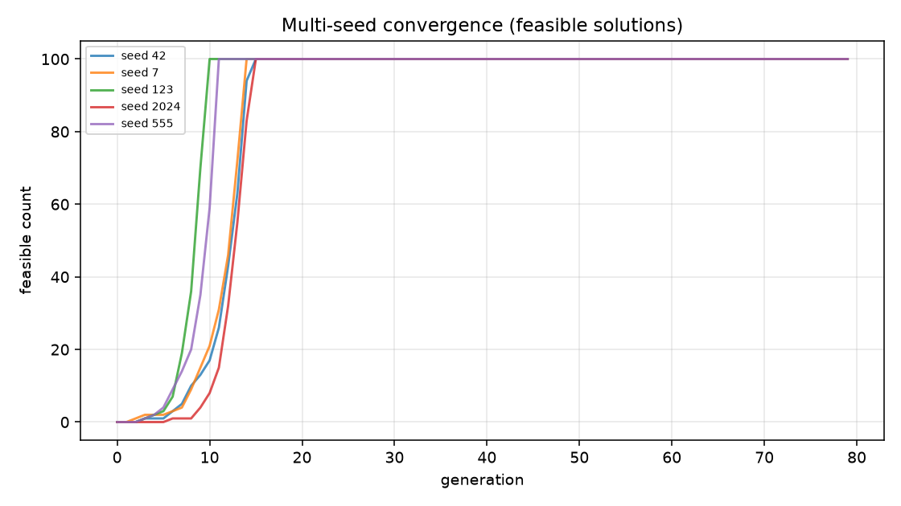
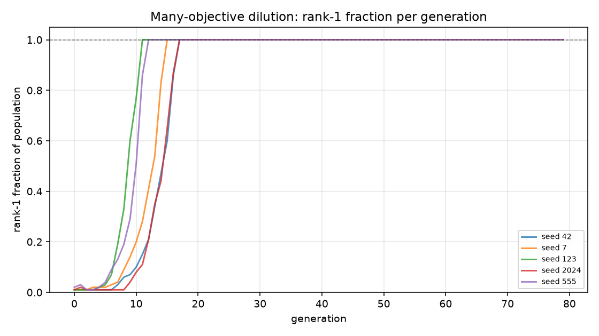
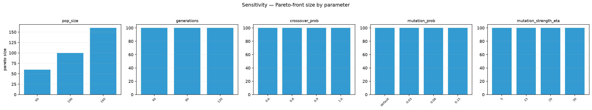
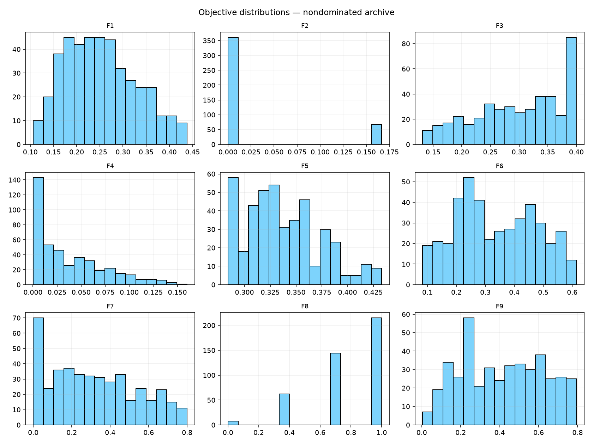
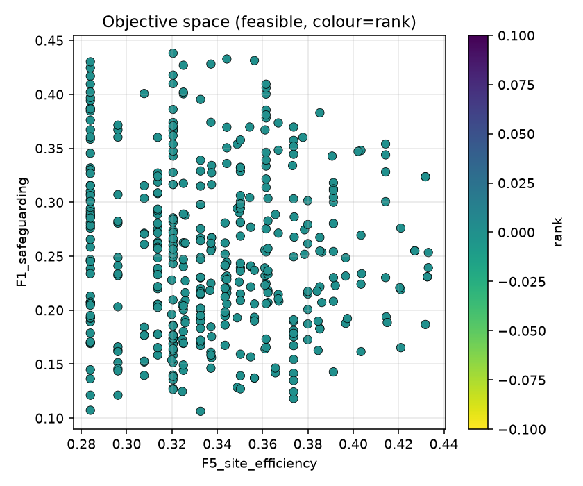
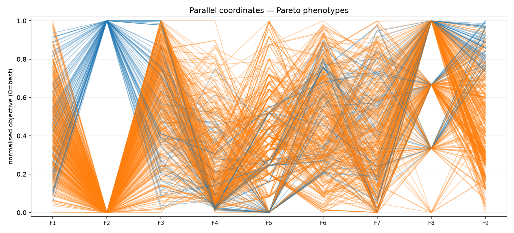
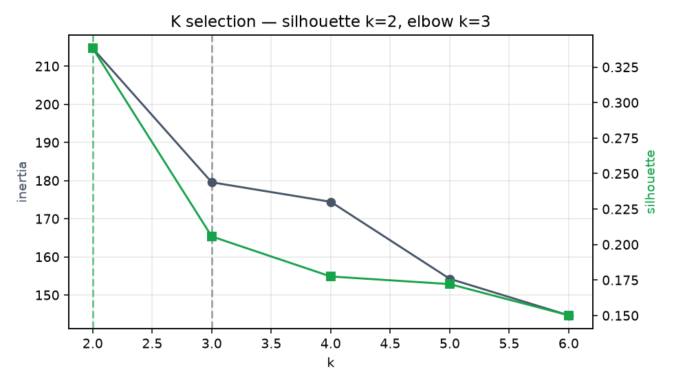
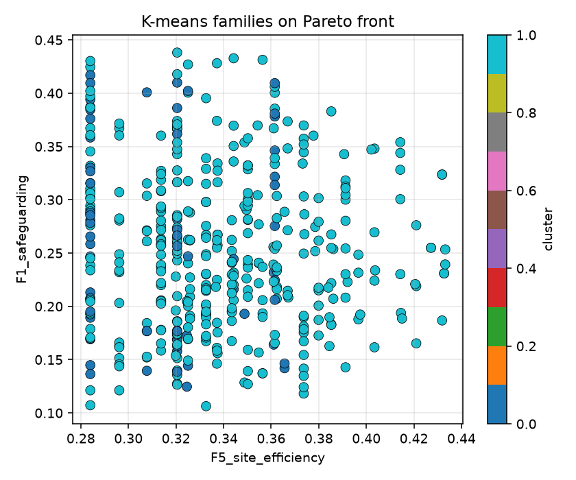
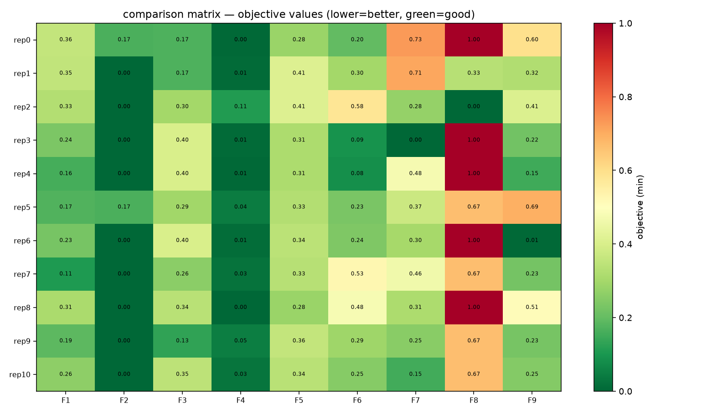

# arsitrad-evo — RESEARCH REPORT
## Evolutionary spatial programming for The Threshold Community (5,533.85 m²)

**Algorithm:** constrained NSGA-II (Deb, Pratap, Agarwal & Meyarivan, 2002) `[PAPER METHOD]`  
**Framework:** modularity-based spatial programming (Riskiyanto, Wibisono & Harani, 2025) — *architectural-scale adaptation* `[PAPER METHOD]`  
**Post-processing:** K-means (silhouette + elbow) — never feeds selection `[DESIGN HYPOTHESIS]`  
**Runtime deps:** Python + numpy/scipy/scikit-learn/matplotlib/pandas only. No Rhino/Grasshopper/Wallacei/jMetal/Helix.

> **Evidence discipline.** `[PAPER METHOD]` validated algorithm/framework · `[PA5 CORPUS]` project program & rules · `[DESIGN HYPOTHESIS]` unvalidated proxy · `[TO VERIFY]` needs authority/operator input. Riskiyanto et al. validated on office furniture; this is an **unvalidated architectural adaptation**. Optimization never overrides safeguarding/accessibility/dignity (hard constraints).

---

## 1. Traceable chain
`MODULE LIBRARY → GENOTYPE → DECODING → HARD CONSTRAINTS → OBJECTIVES → NSGA-II EVOLUTION → PARETO FRONT → K-MEANS CLUSTERS → REPRESENTATIVE PHENOTYPES → ARCHITECTURAL INTERPRETATION`

## 2. Module library → Genotype → Decoding
- **Module library** (`arsitrad_evo/modules.py`): 12 Threshold module types (A0 Civic, B0 Care, C0 Commons, R4 Domestic cluster [repeatable], E0 Staff, F0 Service, M0 Technical, H0 Learning, I0 Reflection, J0 Livelihood, K0 Community, L0 Transition) with net area, privacy level, developmental/variational flag, stacking cap, and the adjacency matrix (MUST/NEAR/SCREENED/AVOID/PROHIBITED).
- **Genotype** (`genotype.py`): mixed real/integer vector. Structural genes — `n_R4` (2–4), `has_H0/J0/K0/I0/L0` (0/1), `floors_C0/H0` (1–2), `landscape_frac`, `service_depth`, `buffer_depth`, `reserve_area` — plus a variable-length (x,y) placement tail. `public_intensity` is **derived** from present public modules for genotype coherence.
- **Decoding**: genotype → placed axis-aligned rectangles (centroid, w×d, floors), derived footprint/GFA/occupancy/landscape, adjacency graph, privacy tags. Phase-1 = program+zoning only.

## 3. Hard constraints (constrained domination)
Violation ≥ 0; feasible iff all hard violations = 0. Feasible always dominates infeasible; among infeasible, smaller total violation wins.
`overlap · site/buildable limit · required developmental modules · permitted populations · prohibited adjacency (R4↔F0/M0/K0) · privacy hierarchy · safeguarding access · care access to R4 · no public→private shortcut · independent service access · stacking rules · landscape band · accessibility/egress (placeholder [TO VERIFY])`. See `constraints.py`.

## 4. Objectives F1–F9 (all minimised)
F1 safeguarding · F2 privacy/agency · F3 everyday life · F4 service separation · F5 site efficiency · F6 adaptability · F7 domestic scale (residential dispersion) · F8 controlled community connection · F9 landscape/buffer. Equations/normalization/assumptions in `objectives.py` + `SPEC.md`.

## 5. NSGA-II evolution — multi-seed runs
Base config: pop=100 gen=80. Seeds: [42, 7, 123, 2024, 555].

| seed | runtime_s | pop | gen | feasible_final | feasible_rate | pareto_size |
|---|---|---|---|---|---|---|
| 42.0 | 13.37 | 100.0 | 80.0 | 100.0 | 1.0 | 100.0 |
| 7.0 | 12.67 | 100.0 | 80.0 | 100.0 | 1.0 | 100.0 |
| 123.0 | 14.51 | 100.0 | 80.0 | 100.0 | 1.0 | 100.0 |
| 2024.0 | 13.1 | 100.0 | 80.0 | 100.0 | 1.0 | 100.0 |
| 555.0 | 13.85 | 100.0 | 80.0 | 100.0 | 1.0 | 100.0 |





*Rank-1 fraction climbs to ~100% by mid-run in every seed — the dynamical signature of many-objective dilution (Campaign v2 measures this per-generation, not via non-dominance inside a filtered archive).*

## 6. Sensitivity tests
Parameters swept: population size, generation count, crossover probability, mutation probability, mutation strength (η). Recorded: runtime, feasible rate, Pareto-front size, objective stats.

| param | value | runtime_s | feasible_rate | pareto_size | obj_F5_mean |
|---|---|---|---|---|---|
| pop_size | 60 | 6.24 | 1.0 | 60 | 0.352 |
| pop_size | 100 | 13.24 | 1.0 | 100 | 0.338 |
| pop_size | 160 | 29.26 | 1.0 | 160 | 0.334 |
| generations | 40 | 5.92 | 1.0 | 100 | 0.32 |
| generations | 80 | 13.22 | 1.0 | 100 | 0.338 |
| generations | 120 | 20.66 | 1.0 | 100 | 0.349 |
| crossover_prob | 0.6 | 15.16 | 1.0 | 100 | 0.342 |
| crossover_prob | 0.8 | 13.11 | 1.0 | 100 | 0.324 |
| crossover_prob | 0.9 | 13.09 | 1.0 | 100 | 0.338 |
| crossover_prob | 1.0 | 13.93 | 1.0 | 100 | 0.345 |
| mutation_prob | default | 13.07 | 1.0 | 100 | 0.338 |
| mutation_prob | 0.03 | 14.44 | 1.0 | 100 | 0.338 |
| mutation_prob | 0.08 | 12.29 | 1.0 | 100 | 0.334 |
| mutation_prob | 0.15 | 11.59 | 1.0 | 100 | 0.35 |
| mutation_strength_eta | 5 | 12.12 | 1.0 | 100 | 0.333 |
| mutation_strength_eta | 15 | 12.84 | 1.0 | 100 | 0.332 |
| mutation_strength_eta | 20 | 13.06 | 1.0 | 100 | 0.338 |
| mutation_strength_eta | 30 | 15.7 | 1.0 | 100 | 0.357 |



## 7. Nondominated archive (Pareto front)
Combined nondominated archive across seeds: **429** solutions (re-sorted on the union of per-seed rank-1 sets).

Objective ranges across the archive:

| objective | min | max |
|---|---|---|
| obj_F1_safeguarding | 0.106 | 0.438 |
| obj_F2_privacy_agency | 0.0 | 0.167 |
| obj_F3_everyday_life | 0.132 | 0.4 |
| obj_F4_service_separation | 0.0 | 0.16 |
| obj_F5_site_efficiency | 0.284 | 0.433 |
| obj_F6_adaptability | 0.083 | 0.614 |
| obj_F7_domestic_scale | 0.0 | 0.799 |
| obj_F8_community_connection | 0.0 | 1.0 |
| obj_F9_landscape_buffer | 0.005 | 0.794 |







## 8. K-means clustering of the Pareto front
Chosen **k = 2** (silhouette) · elbow k = 3 · silhouette = 0.338.





## 9. Representative phenotypes (medoids + objective extremes)
**11** representatives exported, each with a machine-readable traceability record (`data/phenotype_XX.json`).

### 9.1 Comparison matrix
| rep | n_R4 | residents | day_users | gfa | footprint | landscape_frac | F1_safeguarding | F2_privacy_agency | F3_everyday_life | F4_service_separation | F5_site_efficiency | F6_adaptability | F7_domestic_scale | F8_community_connection | F9_landscape_buffer |
|---|---|---|---|---|---|---|---|---|---|---|---|---|---|---|---|
| 0.0 | 2.0 | 8.0 | 8.0 | 841.0 | 840.6 | 0.385 | 0.358 | 0.167 | 0.168 | 0.004 | 0.284 | 0.197 | 0.729 | 1.0 | 0.596 |
| 1.0 | 2.0 | 8.0 | 32.0 | 1335.0 | 1226.2 | 0.499 | 0.354 | 0.0 | 0.17 | 0.009 | 0.414 | 0.299 | 0.709 | 0.333 | 0.322 |
| 2.0 | 2.0 | 8.0 | 32.0 | 1485.0 | 1226.2 | 0.463 | 0.328 | 0.0 | 0.298 | 0.113 | 0.414 | 0.581 | 0.276 | 0.0 | 0.408 |
| 3.0 | 3.0 | 12.0 | 8.0 | 1079.0 | 928.6 | 0.499 | 0.237 | 0.0 | 0.4 | 0.01 | 0.314 | 0.092 | 0.0 | 1.0 | 0.222 |
| 4.0 | 3.0 | 12.0 | 8.0 | 1079.0 | 928.6 | 0.529 | 0.159 | 0.0 | 0.4 | 0.007 | 0.314 | 0.083 | 0.476 | 1.0 | 0.151 |
| 5.0 | 2.0 | 8.0 | 16.0 | 1111.0 | 960.8 | 0.345 | 0.173 | 0.167 | 0.294 | 0.045 | 0.325 | 0.234 | 0.373 | 0.667 | 0.692 |
| 6.0 | 4.0 | 16.0 | 8.0 | 1017.0 | 1016.6 | 0.548 | 0.23 | 0.0 | 0.4 | 0.012 | 0.343 | 0.241 | 0.301 | 1.0 | 0.005 |
| 7.0 | 2.0 | 8.0 | 16.0 | 985.0 | 984.6 | 0.54 | 0.106 | 0.0 | 0.258 | 0.027 | 0.333 | 0.525 | 0.464 | 0.667 | 0.225 |
| 8.0 | 2.0 | 8.0 | 8.0 | 841.0 | 840.6 | 0.422 | 0.31 | 0.0 | 0.339 | 0.0 | 0.284 | 0.479 | 0.313 | 1.0 | 0.508 |
| 9.0 | 2.0 | 8.0 | 16.0 | 1055.0 | 1054.9 | 0.538 | 0.19 | 0.0 | 0.132 | 0.047 | 0.356 | 0.29 | 0.254 | 0.667 | 0.23 |
| 10.0 | 2.0 | 8.0 | 16.0 | 999.0 | 998.1 | 0.53 | 0.262 | 0.0 | 0.347 | 0.031 | 0.337 | 0.251 | 0.155 | 0.667 | 0.247 |



### 9.2 Per-phenotype summaries
#### phenotype_00 — medoid (cluster 0 · seed 42)
- **Capacity:** 8 residents (2 clusters) · 8 day users
- **Areas:** GFA 841 m² · footprint 840.6 m² · landscape 2129.9 m² (38%) · reserve 264.7 m²
- **MUST-adjacency shortfall:** 0.0 m (0 = all satisfied)
- **Genes:** n_R4=2, H0=0, J0=0, K0=0, I0=0, L0=0, public_intensity=0, floors_C0=1
- **Strongest objective:** F4_service_separation · **weakest:** F8_community_connection
- figures: `phenotype_00_siteplan.png`, `_privacy.png`, `_stacking.png`, `_circulation.png`, `_landscape.png`, `_radar.png`

#### phenotype_01 — medoid (cluster 1 · seed 42)
- **Capacity:** 8 residents (2 clusters) · 32 day users
- **Areas:** GFA 1335 m² · footprint 1226.2 m² · landscape 2763.4 m² (50%) · reserve 266.1 m²
- **MUST-adjacency shortfall:** 0.0 m (0 = all satisfied)
- **Genes:** n_R4=2, H0=1, J0=1, K0=1, I0=1, L0=0, public_intensity=3, floors_C0=1, floors_H0=2
- **Strongest objective:** F2_privacy_agency · **weakest:** F7_domestic_scale
- figures: `phenotype_01_siteplan.png`, `_privacy.png`, `_stacking.png`, `_circulation.png`, `_landscape.png`, `_radar.png`

#### phenotype_02 — extreme (cluster 1 · seed 42)
- **Capacity:** 8 residents (2 clusters) · 32 day users
- **Areas:** GFA 1485 m² · footprint 1226.2 m² · landscape 2564.3 m² (46%) · reserve 114.0 m²
- **MUST-adjacency shortfall:** 0.0 m (0 = all satisfied)
- **Genes:** n_R4=2, H0=1, J0=1, K0=1, I0=1, L0=0, public_intensity=3, floors_C0=2, floors_H0=2
- **Strongest objective:** F2_privacy_agency · **weakest:** F6_adaptability
- figures: `phenotype_02_siteplan.png`, `_privacy.png`, `_stacking.png`, `_circulation.png`, `_landscape.png`, `_radar.png`

#### phenotype_03 — extreme (cluster 1 · seed 42)
- **Capacity:** 12 residents (3 clusters) · 8 day users
- **Areas:** GFA 1079 m² · footprint 928.6 m² · landscape 2761.2 m² (50%) · reserve 265.6 m²
- **MUST-adjacency shortfall:** 9.513 m (0 = all satisfied)
- **Genes:** n_R4=3, H0=0, J0=0, K0=0, I0=0, L0=0, public_intensity=0, floors_C0=2
- **Strongest objective:** F2_privacy_agency · **weakest:** F8_community_connection
- figures: `phenotype_03_siteplan.png`, `_privacy.png`, `_stacking.png`, `_circulation.png`, `_landscape.png`, `_radar.png`

#### phenotype_04 — extreme (cluster 1 · seed 7)
- **Capacity:** 12 residents (3 clusters) · 8 day users
- **Areas:** GFA 1079 m² · footprint 928.6 m² · landscape 2926.5 m² (53%) · reserve 270.0 m²
- **MUST-adjacency shortfall:** 37.859 m (0 = all satisfied)
- **Genes:** n_R4=3, H0=0, J0=0, K0=0, I0=0, L0=0, public_intensity=0, floors_C0=2
- **Strongest objective:** F2_privacy_agency · **weakest:** F8_community_connection
- figures: `phenotype_04_siteplan.png`, `_privacy.png`, `_stacking.png`, `_circulation.png`, `_landscape.png`, `_radar.png`

#### phenotype_05 — extreme (cluster 0 · seed 7)
- **Capacity:** 8 residents (2 clusters) · 16 day users
- **Areas:** GFA 1111 m² · footprint 960.8 m² · landscape 1909.8 m² (34%) · reserve 263.7 m²
- **MUST-adjacency shortfall:** 11.765 m (0 = all satisfied)
- **Genes:** n_R4=2, H0=0, J0=0, K0=1, I0=0, L0=0, public_intensity=1, floors_C0=2
- **Strongest objective:** F4_service_separation · **weakest:** F9_landscape_buffer
- figures: `phenotype_05_siteplan.png`, `_privacy.png`, `_stacking.png`, `_circulation.png`, `_landscape.png`, `_radar.png`

#### phenotype_06 — extreme (cluster 1 · seed 123)
- **Capacity:** 16 residents (4 clusters) · 8 day users
- **Areas:** GFA 1017 m² · footprint 1016.6 m² · landscape 3032.7 m² (55%) · reserve 139.9 m²
- **MUST-adjacency shortfall:** 20.537 m (0 = all satisfied)
- **Genes:** n_R4=4, H0=0, J0=0, K0=0, I0=0, L0=0, public_intensity=0, floors_C0=1
- **Strongest objective:** F2_privacy_agency · **weakest:** F8_community_connection
- figures: `phenotype_06_siteplan.png`, `_privacy.png`, `_stacking.png`, `_circulation.png`, `_landscape.png`, `_radar.png`

#### phenotype_07 — extreme (cluster 1 · seed 2024)
- **Capacity:** 8 residents (2 clusters) · 16 day users
- **Areas:** GFA 985 m² · footprint 984.6 m² · landscape 2986.7 m² (54%) · reserve 121.7 m²
- **MUST-adjacency shortfall:** 0.0 m (0 = all satisfied)
- **Genes:** n_R4=2, H0=1, J0=0, K0=0, I0=1, L0=0, public_intensity=1, floors_C0=1, floors_H0=1
- **Strongest objective:** F2_privacy_agency · **weakest:** F8_community_connection
- figures: `phenotype_07_siteplan.png`, `_privacy.png`, `_stacking.png`, `_circulation.png`, `_landscape.png`, `_radar.png`

#### phenotype_08 — extreme (cluster 1 · seed 2024)
- **Capacity:** 8 residents (2 clusters) · 8 day users
- **Areas:** GFA 841 m² · footprint 840.6 m² · landscape 2334.4 m² (42%) · reserve 112.7 m²
- **MUST-adjacency shortfall:** 9.557 m (0 = all satisfied)
- **Genes:** n_R4=2, H0=0, J0=0, K0=0, I0=0, L0=0, public_intensity=0, floors_C0=1
- **Strongest objective:** F2_privacy_agency · **weakest:** F8_community_connection
- figures: `phenotype_08_siteplan.png`, `_privacy.png`, `_stacking.png`, `_circulation.png`, `_landscape.png`, `_radar.png`

#### phenotype_09 — extreme (cluster 1 · seed 2024)
- **Capacity:** 8 residents (2 clusters) · 16 day users
- **Areas:** GFA 1055 m² · footprint 1054.9 m² · landscape 2974.7 m² (54%) · reserve 260.9 m²
- **MUST-adjacency shortfall:** 17.504 m (0 = all satisfied)
- **Genes:** n_R4=2, H0=1, J0=0, K0=0, I0=1, L0=1, public_intensity=1, floors_C0=1, floors_H0=1
- **Strongest objective:** F2_privacy_agency · **weakest:** F8_community_connection
- figures: `phenotype_09_siteplan.png`, `_privacy.png`, `_stacking.png`, `_circulation.png`, `_landscape.png`, `_radar.png`

#### phenotype_10 — extreme (cluster 1 · seed 2024)
- **Capacity:** 8 residents (2 clusters) · 16 day users
- **Areas:** GFA 999 m² · footprint 998.1 m² · landscape 2934.7 m² (53%) · reserve 269.4 m²
- **MUST-adjacency shortfall:** 0.0 m (0 = all satisfied)
- **Genes:** n_R4=2, H0=0, J0=1, K0=0, I0=1, L0=0, public_intensity=1, floors_C0=1
- **Strongest objective:** F2_privacy_agency · **weakest:** F8_community_connection
- figures: `phenotype_10_siteplan.png`, `_privacy.png`, `_stacking.png`, `_circulation.png`, `_landscape.png`, `_radar.png`

## 10. Architectural interpretation
Representatives span the program's real trade-space rather than one fixed answer. The dominant, repeatable structure is a **compact-vs-landscape** axis (the clean k=2 split), overlaid on the genuine **F5–F8 (site-efficiency vs community-connection) conflict**:
- **Compact / low-landscape** (n_R4=2, landscape ~0.35): tighter sites, slightly better F5/F3.
- **Higher-landscape** (n_R4=2/3/4, landscape ~0.46): more buffer, stronger F9.
- **Open (public modules present)** vs **closed (none)** positions the F8 axis; the closed strategy is the most recurrent program in the archive under safeguarding-as-hard-constraint.

> **No universal winner is declared, and no discrete typology is named** — the trade-space is largely continuous (modest silhouette). The actionable output is the 3-candidate shortlist in `DESIGN_HANDOFF_v2.md`. Selection among candidates remains a safeguarding/operator/policy decision, not an optimization output.

## 11. Limitations & unresolved assumptions
- **Many-objective dilution:** with 9 objectives the population becomes all-rank-1 by mid-run (see rank-1 growth figure), so Pareto membership is necessary-but-not-sufficient evidence of quality. Remedies: aggregate objectives, NSGA-III, ε-dominance.
- **Objective proxies are `[DESIGN HYPOTHESIS]`:** F9 ≈ landscape-area (r≈−0.94), F8 ≈ public-module count (r≈−0.73), F7 ≈ f(n_R4), F2/F4 near-binary. Reference ranges in `config.py` need calibration with safeguarding/clinical criteria.
- **Soft MUST-adjacency** is a selection discriminator among feasible solutions, not a hard constraint — representative shortfalls (e.g. B/C candidates) are reported honestly and resolved at schematic stage, not by the optimizer.
- **Low cross-seed program recurrence** (Jaccard ≈ 0.01): independent runs find different specific programs; only trade-space-level and shortlist-level claims are robust.
- **Accessibility/egress** is a placeholder; real dimensions require regulatory review `[TO VERIFY]`.
- **Rectangular site envelope;** real parcel shape/orientation `[TO VERIFY]` before any scaled drawing.
- **Clustering silhouette is modest (k=2, ~0.34)** — the front is largely continuous; the k=2 compact-vs-landscape split is a coarse structure, not discrete types.
- K-means and the architectural-scale adaptation are methodological choices, not validated by the source papers.

## 12. Reproducibility
```bash
python3 -m venv .venv && .venv/bin/pip install -r requirements.txt
.venv/bin/python run_campaign.py --out campaign        # full
.venv/bin/python run_campaign.py --out campaign --quick # fast smoke
.venv/bin/python make_report.py --campaign campaign
```
All runs are seeded; results archived under `campaign/data` + `campaign/figures`.

---
*Generated by make_report.py from campaign outputs. Deb et al. (2002) NSGA-II, IEEE TEVC 6(2) · Riskiyanto, Wibisono & Harani (2025), J. Architecture & Urbanism 49(1).*